# Architecture

Living architecture document. Mermaid sources below; rendered PNGs live in [`figures/`](figures/).

---

## 1. End-to-end system

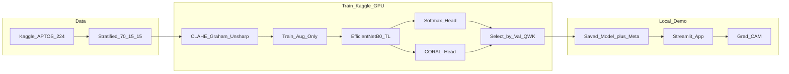

---

## 2. Dataset and split flow

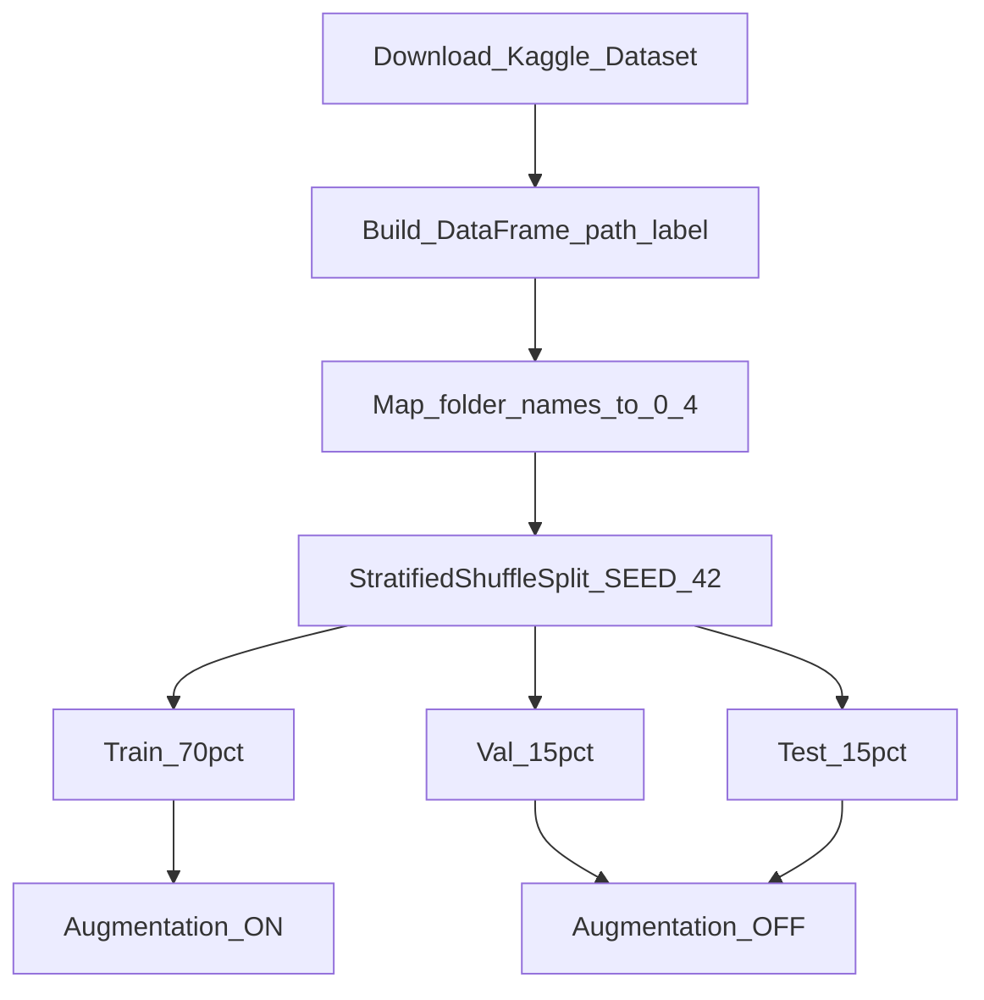

---

## 3. Preprocessing pipeline

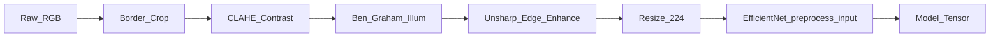

**Parameters (defaults):**

| Step | Key params |
|------|------------|
| Border crop | `tol=7` on dark pixels |
| CLAHE | `clipLimit=2.0`, `tileGridSize=(8,8)` on L channel (LAB) |
| Ben Graham | `addWeighted(img, 4, GaussianBlur(σ=10), -4, 128)` |
| Unsharp | Gaussian blur σ=1.0, amount=1.5 |
| Resize | 224×224 bilinear |

---

## 4. Augmentation (train only)

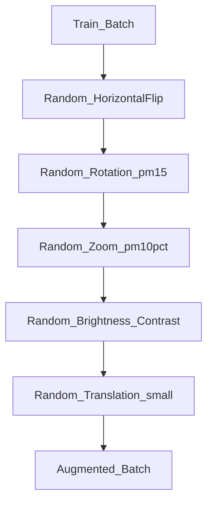

---

## 5. Softmax model architecture

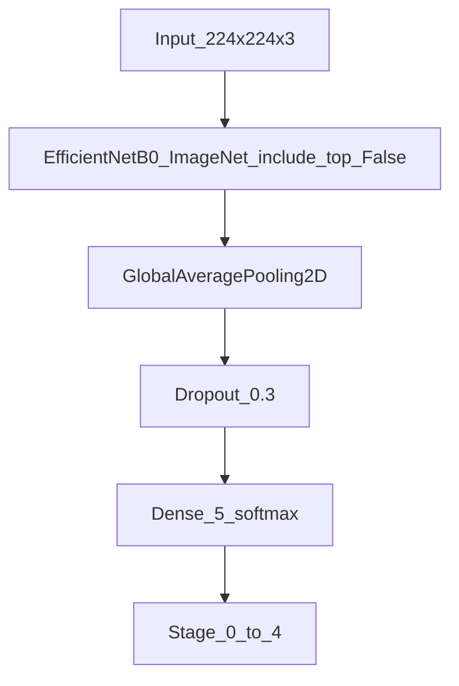

---

## 6. Transfer-learning phases

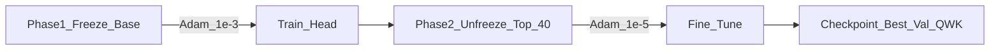

---

## 7. CORAL ordinal architecture

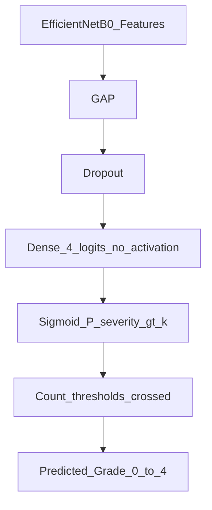

CORAL models \(P(y > k)\) for \(k \in \{0,1,2,3\}\). Loss encourages rank-consistent cumulative probabilities.

---

## 8. Training loop and callbacks

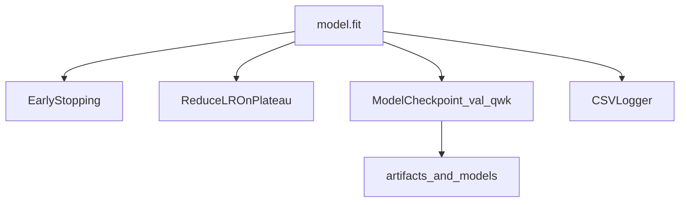

---

## 9. Evaluation dashboard

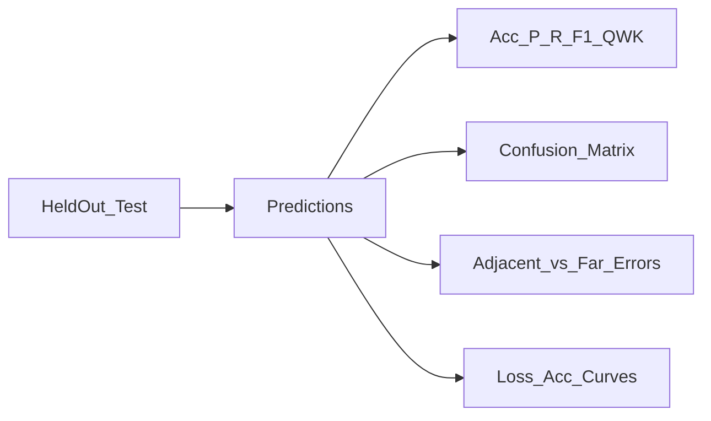

---

## 10. Grad-CAM explainability

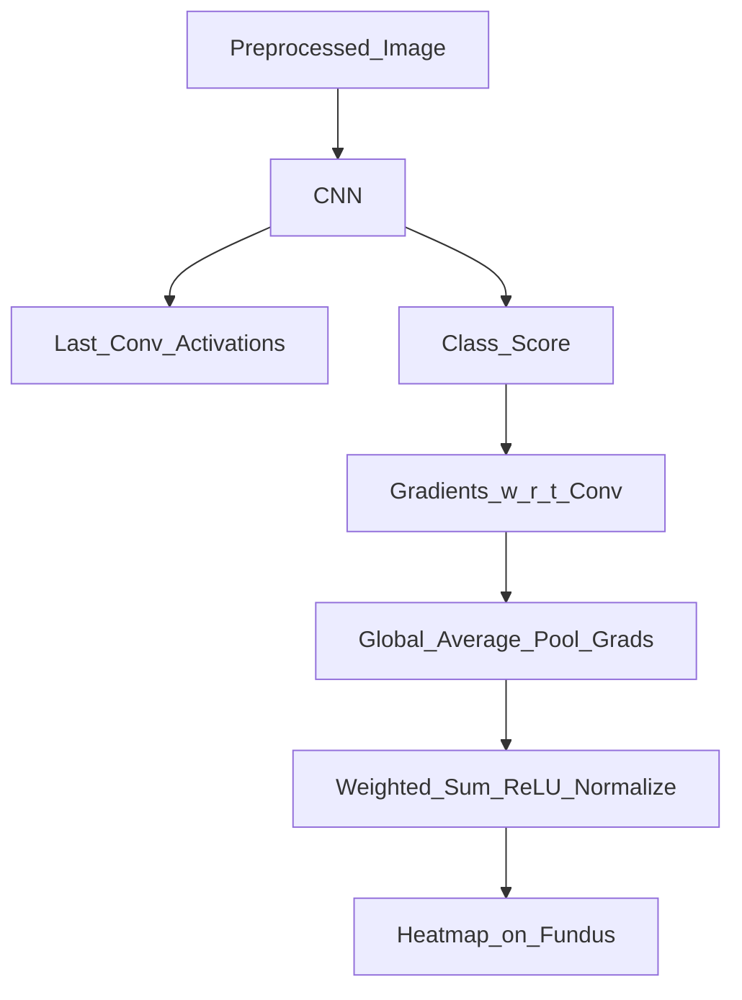

---

## 11. Web demo UX

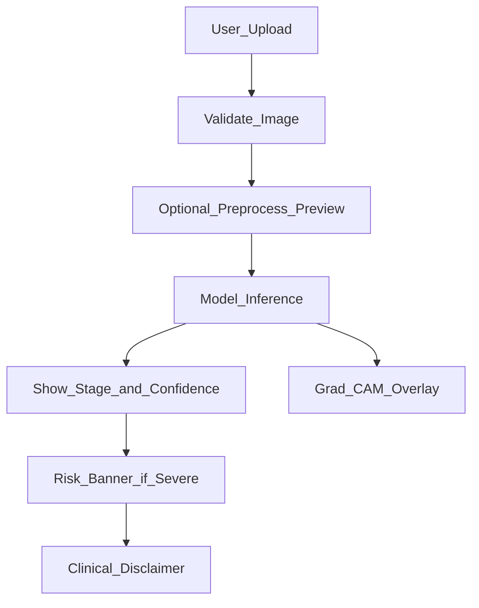

---

## 12. Hardware train / serve

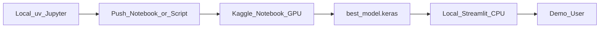
